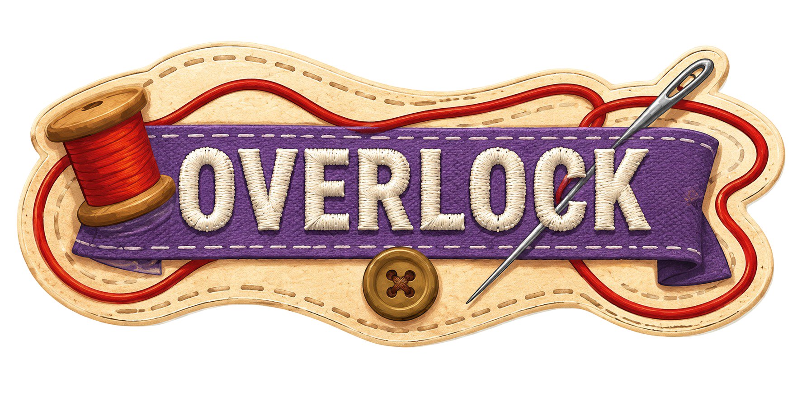

  

<em><b>Overlock:</b> 재봉틀 레이싱 게임</em>

---

Overlock은 재봉틀 조작을 레이싱 게임으로 재해석한 싱글 플레이 타임어택 게임입니다.

재봉틀 노루발과 바늘이 레이싱 차체에 대응되며, 자동으로 전진합니다. 플레이어는 속도 단계와 방향만 조작해 원단 위 재봉 경로를 따라가면 됩니다. 고속에서 급조향하면 손가락을 부상당하는 기믹이 있으며, 피니시 라인까지 걸린 시간을 기록해 트랙별 순위를 겨뤄보세요.

## 실행 방법

~~1. [Godot 4.3](https://godotengine.org/download) 이상을 설치.
2. Godot 에디터를 실행하고 `game/project.godot`을 임포트.
3. 에디터에서 실행(F5).~~

(배포 후 웹 브라우저 링크 첨부)

## 조작법

| 입력 | 기능 |
|---|---|
| `←` / `A` | 왼쪽 조향 |
| `→` / `D` | 오른쪽 조향 |
| `↑` / `W` | 속도 단계 상승 |
| `↓` / `S` | 속도 단계 하락 |
| `R` | 재시작 |
| `Esc` | 일시정지 |

## 문서

- [게임 기획서](docs/design/game_design.md)
- [클라이언트 아키텍처](docs/architecture.md)

## 라이선스

[MIT](LICENSE)
