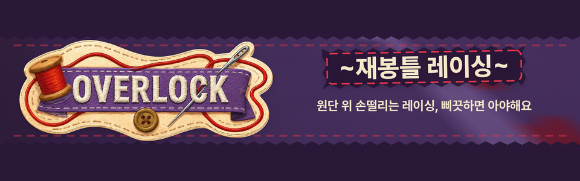
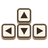
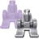
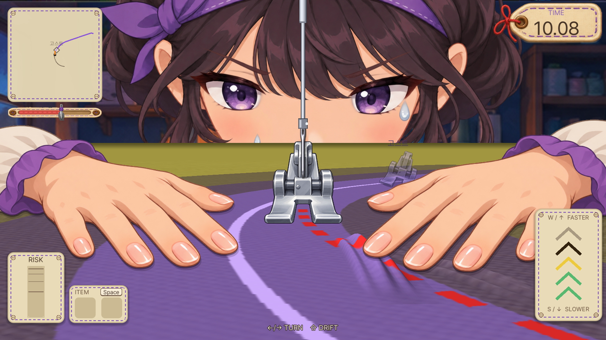
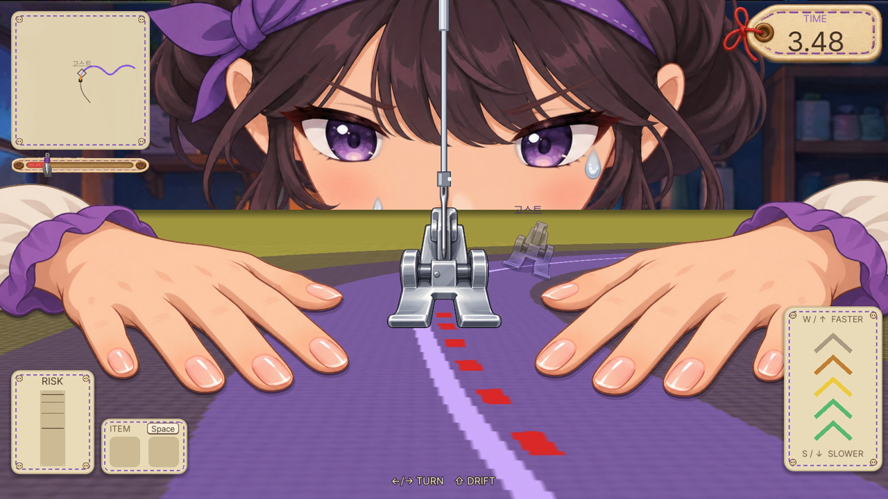
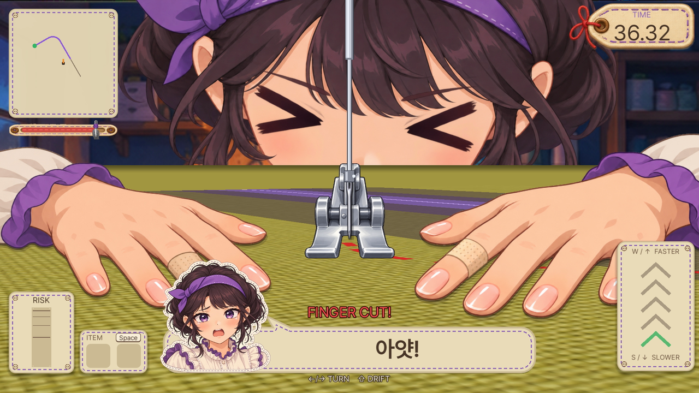
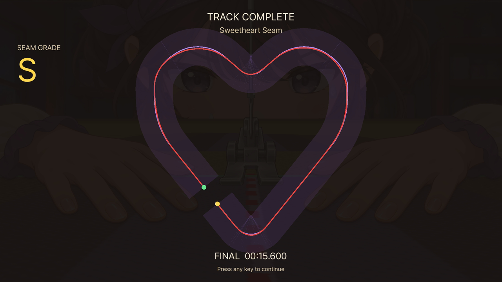
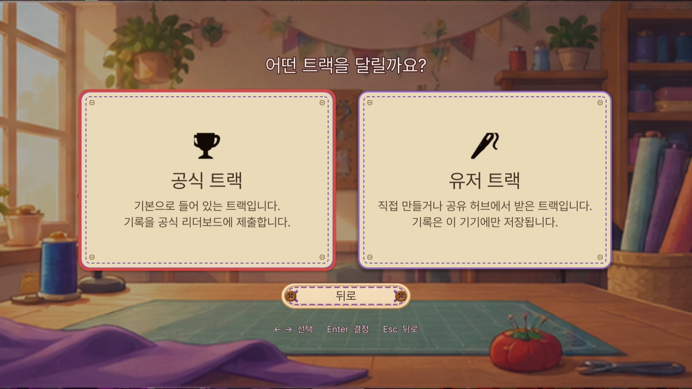
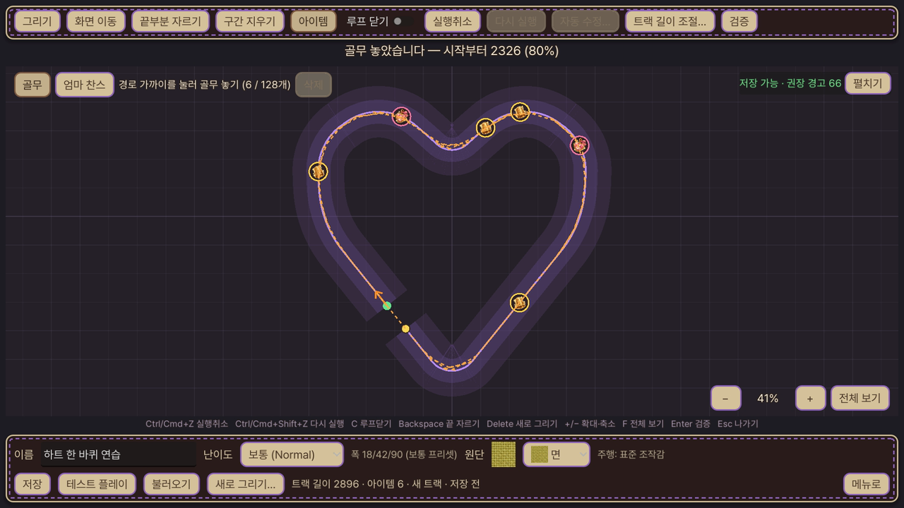
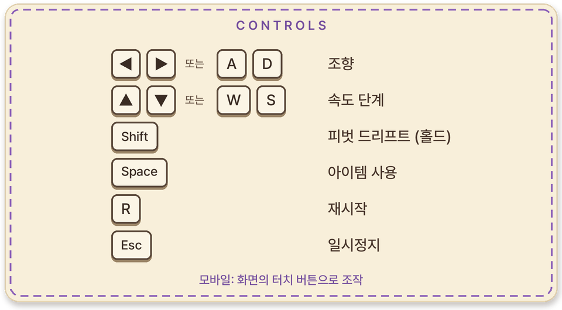

  <picture>
    <source media="(prefers-color-scheme: light)" srcset="./docs/promo/itch/banner_960x300.png">
    <source media="(prefers-color-scheme: dark)" srcset="./docs/promo/itch/banner_960x300_plum.png">
    
  </picture>

<em><b>Overlock(오버로크):</b> 재봉틀 레이싱</em>

---

https://github.com/user-attachments/assets/3fb57be5-73e7-49c7-ae5a-fc2c9d0eaff7

  

## 게임 하기

- 공식 사이트: https://overlock.bnbong.com/
- itch.io: https://bnbong.itch.io/overlock

Overlock은 재봉틀 노루발을 레이싱 머신처럼 몰아 원단 위 재봉선을 따라 달리는 무료 웹 타임어택 게임입니다. 빠르게만 달리면 등급이 떨어지고, 급하게 꺾으면 손가락을 다칩니다. 정직하게 박을수록 높은 등급을 받습니다.

  

<table>
  <tr>
    <td width="100" align="center"></td>
    <td>조작은 속도 단계와 방향, 두 가지뿐입니다. 꼭짓점에서는 Shift로 드리프트하고, 손끝 앞에서 원단이 접혀 올라옵니다.</td>
  </tr>
  <tr>
    <td width="100" align="center"></td>
    <td>재봉선을 얼마나 정직하게 따라갔는지가 등급(S~D)을 정합니다.</td>
  </tr>
  <tr>
    <td width="100" align="center"></td>
    <td>골무와 엄마 찬스를 슬롯에 담아 두었다가 Space로 사용합니다.</td>
  </tr>
  <tr>
    <td width="100" align="center"></td>
    <td>원단 8종마다 주행감이 다릅니다. 실크는 빠르지만 예민하고, 데님은 느리지만 안정적입니다.</td>
  </tr>
  <tr>
    <td width="100" align="center"></td>
    <td>내 최고 기록이 고스트로 함께 달립니다.</td>
  </tr>
  <tr>
    <td width="100" align="center"></td>
    <td>트랙 에디터로 코스를 직접 그리고, 공유 허브에서 올리고 내려받습니다. 공식 트랙 15개와 온라인 리더보드가 있습니다.</td>
  </tr>
</table>

  

<table>
  <tr>
    <td align="center"> 원단이 접혀 올라오는 주행</td>
    <td align="center"> 고스트와 함께 달리기</td>
  </tr>
  <tr>
    <td align="center"> 너무 빠르고 급하게 꺾으면 다침</td>
    <td align="center"> 결승선 통과 연출</td>
  </tr>
  <tr>
    <td align="center"> 공식 트랙 / 유즈맵 선택</td>
    <td align="center"> 유즈맵 트랙 에디터</td>
  </tr>
</table>

  

  

  

조작 키 표 보기

| 입력 | 기능 |
|---|---|
| `←` / `A` | 왼쪽 조향 |
| `→` / `D` | 오른쪽 조향 |
| `↑` / `W` | 속도 단계 상승 |
| `↓` / `S` | 속도 단계 하락 |
| `⇧ Shift` (홀드) | 피벗 드리프트 |
| `Space` | 보관한 아이템 사용 |
| `R` | 재시작 |
| `Esc` | 일시정지 |

## 참고

- 데스크톱 브라우저에서 플레이하는 것을 권장합니다.
- 모바일에서는 화면에 표시되는 터치 버튼으로 조작하며, 가로 화면으로 플레이해야 합니다.
- 로컬 기록과 고스트는 브라우저에 저장되며, 사이트마다 따로 관리됩니다. 공식 사이트와 itch.io의 로컬 기록과 고스트는 서로 공유되지 않습니다.

## 문서

- [게임 기획서](https://github.com/bnbong/Overlock/wiki/Overlock-%EA%B2%8C%EC%9E%84-%EA%B8%B0%ED%9A%8D%EC%84%9C)
- [클라이언트 아키텍처](docs/architecture.md)
- [트랙 에디터 설계](docs/track_editor.md)
- [연출](docs/presentation.md)
- [웹 배포 가이드](docs/deploy.md)
- [리더보드 서버](server/README.md)
- [기여 안내](CONTRIBUTING.md)

## 라이선스

본 게임은 "용과 같이 극 3"의 미니 게임을 오마주한 프로젝트이며, ⓒ SEGA 및 "용과 같이" 시리즈와 무관한 프로젝트입니다. 이 프로젝트의 에셋은 오리지널 제작(일부 AI 생성)입니다.

[MIT](LICENSE)
