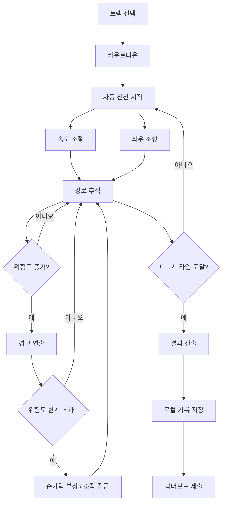
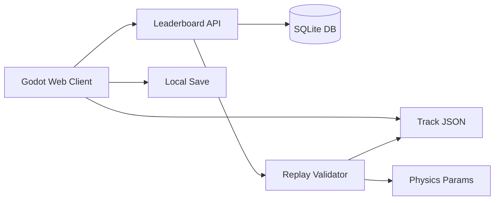

# 재봉 레이싱 게임 기획안

- 문서 버전: v0.1
- 작성일: 2026-06-18
- 프로젝트 상태: 콘셉트 / 시스템 기획 초안
- 권장 작업명: `Stitchline Sprint`, `Needle Drift`, `Seam Racer`, `Threadline GP`

---

## 1. 개요

이 프로젝트는 재봉틀 조작을 레이싱 게임의 문법으로 재해석한 싱글 플레이 타임어택 게임이다. 플레이어는 화면 중앙의 재봉틀 노루발과 바늘을 기준점으로 삼아 원단 위의 재봉 경로를 따라간다. 전진은 자동이며, 플레이어는 속도 단계와 방향만 조작한다.

핵심 재미는 다음 구조에서 나온다.

1. 노루발은 항상 전진한다.
2. 플레이어는 속도를 올리거나 낮출 수 있다.
3. 좌우 방향 입력은 누적되어 목표 조향각을 만든다.
4. 실제 노루발 반응은 목표 조향각보다 늦게 따라온다.
5. 고속 상태에서 급격하게 방향을 전환하면 손가락 부상 위험이 증가한다.
6. 피니시 라인까지 도달한 시간을 기록하고, 트랙별 리더보드에서 경쟁한다.

게임은 오픈소스 공개를 전제로 하며, 기존 상용 게임의 구체적인 캐릭터, UI, 아트, 효과음, 명칭, 연출을 직접 복제하지 않고 독립적인 재봉 레이싱 게임으로 설계한다.

---

## 2. 한 줄 콘셉트

**자동으로 전진하는 재봉틀 노루발을 속도와 조향 지연을 예측하며 조작해, 원단 위의 재봉선을 가장 빠르고 정확하게 완주하는 타임어택 게임.**

---

## 3. 장르와 플레이 목표

| 항목 | 내용 |
|---|---|
| 메인 장르 | 아케이드 레이싱 / 타임어택 |
| 서브 장르 | 정밀 조작, 라인 트레이싱, 리스크 관리 |
| 플레이 방식 | 싱글 플레이 |
| 세션 길이 | 30초 ~ 3분 |
| 주요 목표 | 재봉 경로를 따라 피니시 라인까지 가장 빠르게 도달 |
| 보조 목표 | 경로 정확도 유지, 부상 최소화, 원단 손상 방지 |
| 경쟁 요소 | 트랙별 온라인 리더보드 |
| 권장 시점 | 2D 판정 기반의 2.5D 연출 |

---

## 4. 핵심 디자인 원칙

### 4.1 전진은 자동이다

플레이어가 조작하지 않아도 노루발은 계속 전진한다. 후진과 브레이크는 없다. 게임의 긴장감은 “멈출 수 없음”에서 나온다.

### 4.2 속도는 선택 가능한 리스크다

빠르게 달리면 기록은 좋아지지만 다음 문제가 커진다.

- 조향 반응 지연으로 인한 경로 이탈
- 고속 급조향으로 인한 손가락 부상 위험
- 실 장력 불안정
- 원단 손상
- 바늘 파손 또는 과열

### 4.3 입력과 실제 반응 사이에 지연이 있다

플레이어가 왼쪽 또는 오른쪽 방향키를 오래 누르면 목표 조향각은 커진다. 그러나 실제 노루발은 그 목표에 즉시 도달하지 않고 약간 늦게 따라온다.

이 구조 때문에 플레이어는 코너를 보자마자 꺾는 것이 아니라, 원단과 노루발의 반응을 예측하며 미리 조향해야 한다.

### 4.4 실수는 이해 가능해야 한다

손가락 부상, 원단 찢김, 바늘 파손 같은 페널티는 랜덤 이벤트처럼 느껴지면 안 된다. 반드시 명확한 전조가 있어야 한다.

- 위험도 UI 점멸
- 바늘 소리 피치 상승
- 손 위치 경고
- 화면 흔들림
- 캐릭터 표정 변화
- 재봉선 색상 변화

### 4.5 전체 맵은 숨긴다

미니맵은 전체 원단 지형을 보여주지 않는다. 내비게이션처럼 현재 위치 주변과 가까운 미래 경로만 표시한다. 플레이어는 전체를 암기하기보다 현재 속도와 조향 상태를 기반으로 바로 앞 구간을 해석한다.

---

## 5. 시각 콘셉트

### 5.1 화면 구성

화면은 크게 다섯 레이어로 구성한다.

1. 배경 캐릭터 얼굴
2. 좌우 손
3. 재봉틀 노루발과 바늘
4. 원단과 재봉 경로
5. UI

기본 구도는 다음과 같다.

```text
┌────────────────────────────────────────────┐
│ 미니맵                         스톱워치      │
│                                            │
│       배경 캐릭터 얼굴 / 눈 / 표정            │
│                                            │
│──────────── 수평선 / 재봉 작업면 ────────────│
│                                            │
│   왼손        바늘 / 노루발        오른손      │
│                                            │
│          원단 위 재봉 경로 / 피니시 라인       │
│                                            │
│                         속도 UI / 위험 UI    │
└────────────────────────────────────────────┘
```

### 5.2 추천 표현 방식

최종 권장 방식은 **2D 판정 + 2.5D 연출**이다.

| 방식 | 장점 | 단점 | 판단 |
|---|---|---|---|
| 순수 2D | 구현 빠름, 웹 성능 유리, 판정 단순 | 재봉틀 깊이감 표현 제한 | 프로토타입에 적합 |
| 2.5D | 2D 판정과 원근감 있는 화면 연출을 동시에 달성 | 레이어와 셰이더 설계 필요 | 최종 권장 |
| 풀 3D | 카메라 연출, 손/노루발 입체감 우수 | 모델링, 리깅, 애니메이션, 최적화 부담 큼 | 후순위 |

### 5.3 2.5D 구현 아이디어

- 원단은 2D 텍스처를 사용한다.
- 재봉 경로는 2D 스플라인으로 판정한다.
- 노루발과 바늘은 스프라이트 또는 간단한 3D 오브젝트로 표현한다.
- 손과 얼굴은 2D 일러스트 또는 프리렌더 이미지를 사용한다.
- 원단 레이어에 원근 왜곡 셰이더를 적용해 바늘 아래로 빨려 들어가는 느낌을 만든다.
- 속도가 올라갈수록 바늘 왕복 속도, 화면 진동, 재봉음 피치가 증가한다.

---

## 6. 핵심 게임 루프



플레이어의 한 세션은 다음 흐름을 따른다.

1. 트랙을 선택한다.
2. 카운트다운 후 노루발이 자동 전진한다.
3. 플레이어는 속도 단계와 좌우 방향을 조작한다.
4. 재봉 경로 중심선에서 벗어나지 않도록 조향한다.
5. 고속 급조향, 원단 특성, 경로 이탈로 위험도가 증가한다.
6. 부상이나 원단 손상 발생 시 시간 손실 또는 페널티가 발생한다.
7. 피니시 라인 도달 시 최종 기록을 산출한다.
8. 기록을 로컬 또는 온라인 리더보드에 저장한다.

---

## 7. 메인 시스템 상세

## 7.1 플레이어 상태값

게임의 주요 상태값은 다음과 같다.

```text
position        현재 원단 월드 좌표
heading         현재 진행 방향
speed           현재 재봉 속도
target_steer    입력으로 만들어진 목표 조향값
actual_steer    노루발이 실제로 따라간 조향값
risk            손가락 부상 위험도
accuracy        재봉 경로 정확도
stun_timer      부상으로 인한 조작 불능 시간
seam_error      경로 중심선과 현재 위치의 거리
fabric_state    현재 원단 물성 상태
thread_tension  실 장력
needle_heat     바늘 과열도
```

---

## 7.2 자동 전진 시스템

노루발은 항상 앞으로 전진한다.

설계 조건:

- 기본 속도는 0보다 크다.
- 후진 입력은 없다.
- 브레이크 입력은 없다.
- 속도 감소는 브레이크가 아니라 재봉 속도 단계 하락으로 처리한다.
- 부상 상태에서도 완전 정지보다는 최소 속도 자동 진행을 권장한다.

권장 속도 단계:

| 단계 | 명칭 | 예시 속도 | 특징 |
|---|---:|---:|---|
| 1 | Safety | 80 | 안전하지만 기록이 느림 |
| 2 | Normal | 120 | 기본 속도 |
| 3 | Fast | 170 | 일반 코너에서 위험 발생 |
| 4 | Rush | 230 | 급커브 대응 어려움 |
| 5 | Overlock | 300 | 고위험 타임어택 속도 |

초기 단위는 `px/s` 또는 Godot 월드 단위로 정의하고, 조작감 테스트 후 보정한다.

---

## 7.3 방향 전환 시스템

방향키 입력은 즉시 회전이 아니라 목표 조향값을 증가시키는 방식이다.

```text
왼쪽 입력 유지  → target_steer가 음수 방향으로 누적
오른쪽 입력 유지 → target_steer가 양수 방향으로 누적
입력 없음       → target_steer가 천천히 0으로 복귀
```

실제 진행 방향에는 `actual_steer`가 반영된다. `actual_steer`는 `target_steer`를 느리게 따라간다.

```gdscript
# 개념용 GDScript 형태 pseudo-code

func update_steering(delta: float) -> void:
    if stun_timer > 0.0:
        target_steer = move_toward(target_steer, 0.0, stun_steer_return_rate * delta)
    elif Input.is_action_pressed("steer_left"):
        target_steer -= steer_charge_rate * delta
    elif Input.is_action_pressed("steer_right"):
        target_steer += steer_charge_rate * delta
    else:
        target_steer = move_toward(target_steer, 0.0, steer_return_rate * delta)

    target_steer = clamp(target_steer, -1.0, 1.0)

    actual_steer = move_toward(
        actual_steer,
        target_steer,
        foot_response_rate * delta
    )
```

핵심 튜닝 조건:

```text
steer_charge_rate > foot_response_rate
```

이 조건 때문에 플레이어가 입력한 방향보다 노루발이 약간 늦게 따라온다.

---

## 7.4 이동 계산

이동은 단순한 2D 벡터 모델로 시작한다.

```gdscript
func update_movement(delta: float) -> void:
    var speed_factor := speed / max_speed
    heading += actual_steer * turn_power * speed_factor * delta

    var forward := Vector2(cos(heading), sin(heading))
    position += forward * speed * delta
```

초기에는 이 모델로 충분하다. 이후 필요하면 다음 요소를 추가한다.

- 원단별 마찰 계수
- 원단 미끄러짐
- 두꺼운 원단에서의 반응 지연
- 바늘 과열에 따른 속도 제한
- 경로 이탈 시 원단 저항 증가

---

## 7.5 손가락 부상 시스템

손가락 부상은 핵심 리스크 시스템이다. 고속 상태에서 과도한 조향 입력과 실제 조향 지연이 동시에 커질 때 위험도가 증가한다.

위험도 기본 공식:

```text
위험도 증가량 = 속도 계수 × 조향 입력량 × 조향 지연량 × 바늘 근접 계수
```

예시 구현:

```gdscript
func update_finger_risk(delta: float) -> void:
    var steer_gap := abs(target_steer - actual_steer)
    var speed_factor := inverse_lerp(min_speed, max_speed, speed)
    var steer_factor := abs(target_steer)
    var proximity_factor := get_finger_proximity_factor()

    var danger_gain := speed_factor * speed_factor * steer_factor * steer_gap * proximity_factor

    if danger_gain > danger_threshold:
        risk += danger_gain * risk_gain_rate * delta
    else:
        risk = move_toward(risk, 0.0, risk_recover_rate * delta)

    if risk >= 1.0:
        trigger_finger_cut()
```

부상 발생 효과:

| 항목 | 효과 |
|---|---|
| 조작 | 1.5초 ~ 2.5초 조작 잠금 |
| 속도 | 최소 속도 또는 1단으로 강제 하락 |
| 조향 | `actual_steer`가 서서히 0으로 복귀 |
| 시간 | 스톱워치는 계속 진행 |
| 결과 | 부상 횟수 기록, 타이브레이커에서 불리 |
| 연출 | 손 움찔, 화면 흔들림, 경고음, 바늘 충격 이펙트 |

부상 직전 경고:

| 위험도 | 연출 |
|---:|---|
| 0.50 | 위험 UI 노란색 점멸 |
| 0.70 | 바늘 소리 피치 상승 |
| 0.85 | 손 주변 빨간 경고 표시 |
| 0.95 | 짧은 슬로모션 또는 강한 화면 흔들림 |
| 1.00 | 부상 발생 |

부상은 게임 실패 조건이 아니라 시간 손실을 만드는 장치로 두는 것이 좋다. 이렇게 해야 타임어택 흐름이 끊기지 않는다.

---

## 7.6 경로 정확도 시스템

원단 위 재봉 경로는 중심선과 판정 폭으로 구성한다.

```text
centerline      재봉해야 하는 이상적인 중심선
perfect_width   완벽 판정 폭
safe_width      정상 판정 폭
fail_width      실패 또는 큰 페널티 판정 폭
```

판정 예시:

| 중심선 거리 | 판정 | 효과 |
|---:|---|---|
| `<= perfect_width` | Perfect | 정확도 상승, 콤보 증가 |
| `<= safe_width` | Good | 정상 진행 |
| `<= fail_width` | Off Seam | 정확도 감소, 원단 손상 누적 |
| `> fail_width` | Tear | 큰 페널티 또는 구간 재시작 |

정확도는 결과 화면과 리더보드 타이브레이커에 사용한다.

권장 산출값:

```text
accuracy = 100 - normalized_error_score
```

단순한 시작 공식:

```text
normalized_error_score = 평균 중심선 거리 / safe_width × 100
```

---

## 7.7 시간과 페널티

기본 기록은 피니시 라인 도달 시간이다. 실수는 시간 페널티로 환산한다.

```text
final_time = finish_time + penalty_time
```

페널티 예시:

| 실수 | 페널티 |
|---|---:|
| Off Seam 1초 | +0.5초 |
| 손가락 부상 1회 | +2.0초 또는 조작 잠금 시간만 반영 |
| 원단 찢김 | +5.0초 |
| 바늘 파손 | +8.0초 또는 즉시 실패 |
| 실 끊김 | +3.0초 |

초기 MVP에서는 부상과 경로 이탈만 구현한다. 바늘 파손과 실 끊김은 추후 확장 기능으로 둔다.

---

## 7.8 콤보 시스템

콤보는 타임어택의 명확성을 해치지 않도록 보조 지표로 사용한다.

```text
Perfect 유지 → 콤보 증가
Good 유지    → 콤보 유지
Off Seam     → 콤보 초기화
Finger Cut   → 콤보 초기화
```

콤보를 최종 시간에서 직접 차감하면 리더보드 검증이 복잡해질 수 있다. 초기에는 결과 화면의 숙련도 지표로만 표시한다.

---

## 7.9 실 장력 시스템

추후 확장용 시스템이다.

실 장력은 다음 상황에서 증가한다.

- 고속 상태 지속
- 급격한 조향 반복
- 두꺼운 원단 구간 통과
- 경로 이탈 상태에서 무리한 조향

실 장력이 높으면 다음 효과가 발생한다.

- 재봉음이 불안정해진다.
- 실이 화면에서 떨린다.
- 일정 수치 이상이면 실이 끊어진다.
- 실 끊김 시 짧은 수리 애니메이션 또는 시간 페널티가 발생한다.

MVP에서는 제외한다.

---

## 7.10 바늘 과열 / 파손 시스템

추후 확장용 시스템이다.

바늘 과열은 고속 주행과 두꺼운 원단에서 증가한다.

| 상태 | 효과 |
|---|---|
| 정상 | 변화 없음 |
| 과열 | 바늘 색상 변화, 소리 거칠어짐 |
| 위험 | 속도 단계 제한 또는 진동 증가 |
| 파손 | 큰 시간 페널티 또는 구간 재시작 |

이 시스템은 난이도를 크게 올리므로 MVP 이후에 추가한다.

---

## 8. UI 기획

## 8.1 필수 UI

| UI | 위치 | 기능 |
|---|---|---|
| 스톱워치 | 우상단 | 현재 시간, 피니시 기록 |
| 속도 게이지 | 우측 | 현재 속도 단계 표시 |
| 미니맵 | 좌상단 | 현재 주변 경로만 표시 |
| 위험도 표시 | 바늘 주변 또는 하단 | 손가락 부상 위험 경고 |
| 정확도 표시 | 결과 화면 중심 | 경로 추적 정확도 |
| 상태 표시 | 하단 | 부상, 원단 손상, 실 장력 등 |

## 8.2 속도 UI

속도 UI는 단계형 게이지를 권장한다.

```text
[1] [2] [3] [4] [5]
```

각 단계는 직관적으로 위험도가 느껴져야 한다.

- 1~2단: 안정적인 색상과 낮은 진동
- 3단: 기본 타임어택 속도
- 4단: 경고성 진동 추가
- 5단: 게이지 점멸, 바늘 소리 강화

## 8.3 미니맵

미니맵은 전체 트랙을 보여주지 않고 현재 위치 주변만 표시한다.

표시 범위:

```text
뒤쪽: 최근 1~2초 이동분
앞쪽: 현재 속도 기준 3~5초 후까지의 경로
```

권장 계산:

```text
preview_distance = speed * 4.0
back_distance = speed * 1.5
```

미니맵 표시 요소:

- 현재 노루발 위치
- 진행 방향 화살표
- 가까운 미래 경로
- 급커브 경고
- 위험 구간 아이콘
- 피니시 라인 근접 시 표시

미니맵에서 숨길 요소:

- 전체 트랙 구조
- 먼 미래의 급커브
- 모든 장애물의 위치
- 완전한 최적 라인

## 8.4 결과 화면

결과 화면 필수 항목:

```text
Track
Difficulty
Finish Time
Penalty
Final Time
Accuracy
Perfect Rate
Off-Seam Time
Finger Cuts
Max Speed
Average Speed
Replay Available
Submit to Leaderboard
```

결과 화면 예시:

```text
Track: Cotton Warm-up
Difficulty: Normal
Finish Time: 01:24.231
Penalty: +00:03.000
Final Time: 01:27.231
Accuracy: 94.2%
Perfect Rate: 61.8%
Finger Cuts: 1
Max Speed: 5
Average Speed: 3.4
```

---

## 9. 트랙 / 스테이지 설계

## 9.1 트랙 데이터 철학

트랙은 이미지 파일이 아니라 데이터로 정의한다. 이 방식은 오픈소스 프로젝트와 잘 맞는다.

장점:

- 커뮤니티가 쉽게 트랙을 제작할 수 있다.
- 서버 검증이 가능하다.
- 리더보드에서 트랙 체크섬을 사용할 수 있다.
- 난이도와 경로 폭을 수치로 튜닝할 수 있다.

## 9.2 트랙 JSON 예시

```json
{
  "track_id": "cotton_01",
  "name": "Cotton Warm-up",
  "difficulty": "normal",
  "fabric": "cotton",
  "length": 3200,
  "width": {
    "perfect": 18,
    "safe": 42,
    "fail": 90
  },
  "path": [
    {
      "type": "bezier",
      "p0": [0, 0],
      "p1": [200, 0],
      "p2": [300, 120],
      "p3": [400, 240]
    },
    {
      "type": "bezier",
      "p0": [400, 240],
      "p1": [520, 420],
      "p2": [760, 420],
      "p3": [900, 260]
    }
  ],
  "modifiers": [
    {
      "s": 900,
      "type": "slippery",
      "duration": 300,
      "strength": 0.4
    },
    {
      "s": 1700,
      "type": "thick_fabric",
      "duration": 450,
      "strength": 0.6
    }
  ]
}
```

## 9.3 원단 타입

| 원단 | 조작 특성 | 추천 난이도 |
|---|---|---|
| 면 | 기본 조작감 | Beginner / Normal |
| 데님 | 속도는 느리지만 안정적, 바늘 부담 증가 | Normal |
| 실크 | 미끄러짐과 조향 지연 증가 | Expert |
| 니트 | 원단 늘어남으로 경로 흔들림 | Expert |
| 가죽 | 조향 반응 둔함, 바늘 과열 위험 | Master |
| 패치워크 | 구간별 물성 변화 | Master |

## 9.4 트랙 구성 요소

초기 구현 순서:

1. 직선 구간
2. 완만한 곡선
3. 급커브
4. 좁은 경로
5. 원단 주름
6. 미끄러운 구간
7. 두꺼운 구간
8. 실 장력 불안정 구간
9. 분기 경로
10. 커뮤니티 제작 패턴

## 9.5 난이도 구분

| 난이도 | 특징 |
|---|---|
| Beginner | 넓은 경로, 긴 미니맵 예측 거리, 낮은 부상 위험 |
| Normal | 기본 규칙 |
| Expert | 경로 좁음, 급커브 많음, 부상 위험 높음 |
| Master | 미니맵 예측 짧음, 원단 물성 변화 많음 |
| Hardcore | 부상 시 큰 페널티, 리더보드 별도 분리 |

---

## 10. 게임 모드

## 10.1 Time Attack

메인 모드다.

- 트랙별 기록 경쟁
- 최종 시간 기준 랭킹
- 부상, 경로 이탈, 원단 손상은 시간 페널티
- 로컬 최고 기록 저장
- 온라인 리더보드 제출

## 10.2 Practice

연습 모드다.

- 리더보드 제출 불가
- 위험도 표시 강화
- 부상 비활성화 또는 약화 가능
- 경로 중심선 표시
- 추천 속도 구간 표시

## 10.3 Precision Mode

정확도 중심 모드다.

- 제한 시간 내 최대 정확도 목표
- 속도보다 안정적인 조작이 중요
- 재봉 테마를 더 강하게 살릴 수 있음

## 10.4 Daily Pattern

추후 업데이트용 모드다.

- 매일 하나의 고정 시드 트랙 제공
- 하루 단위 리더보드
- 개인 도메인 재방문 동기 제공
- 공식 트랙과 별도 랭킹 운영

---

## 11. 조작 설계

## 11.1 키보드

| 입력 | 기능 |
|---|---|
| `←` / `A` | 왼쪽 조향 |
| `→` / `D` | 오른쪽 조향 |
| `↑` / `W` | 속도 단계 상승 |
| `↓` / `S` | 속도 단계 하락 |
| `R` | 재시작 |
| `Esc` | 일시정지 |
| `Tab` | 고스트 표시 토글 |

## 11.2 게임패드

| 입력 | 기능 |
|---|---|
| Left Stick | 조향 |
| `Y` / `RB` | 속도 상승 |
| `A` / `LB` | 속도 하락 |
| Start | 일시정지 |

게임패드는 선택 기능이다. MVP에서는 키보드만 구현해도 된다.

---

## 12. 기술 스택 제안

## 12.1 최종 권장 스택

```text
Client Game: Godot 4.x + GDScript
Rendering: 2D gameplay + 2.5D presentation
Backend: Python + FastAPI
Database: SQLite initially, PostgreSQL later if needed
Hosting: 개인 도메인 + 정적 웹 호스팅 + API 서버
Repository: GitHub public repository
```

Godot를 권장하는 이유는 다음과 같다.

- 2D 게임 구현이 빠르다.
- 2.5D 또는 부분 3D 확장 여지가 있다.
- 씬, 애니메이션, UI, 입력, 사운드 시스템이 통합되어 있다.
- GDScript는 들여쓰기 기반 문법을 사용해 Python 경험자가 적응하기 쉽다.
- 웹 export가 가능하다.

주의할 점:

- Godot 웹 export는 브라우저의 WebAssembly와 WebGL 2.0 지원이 필요하다.
- Godot 4의 C# 프로젝트는 현재 웹 export 대상이 아니므로 GDScript를 쓰는 편이 안전하다.
- 모바일 웹은 성능과 입력 UX 제약이 있을 수 있다.

## 12.2 Python의 역할

Python은 클라이언트 메인 게임보다는 서버와 도구에 사용하는 것이 적합하다.

```text
/server        리더보드 API
/tools         트랙 생성기, 베지어 경로 편집기 보조 도구
/validator     리플레이 검증기
/analytics     플레이 로그 분석
```

Python 숙련도를 가장 잘 활용할 수 있는 부분은 다음이다.

- 리더보드 API
- 기록 검증
- 리플레이 재시뮬레이션
- 트랙 데이터 검증
- 플레이 로그 분석
- 난이도 자동 산출 도구

## 12.3 대안 비교

| 선택지 | 장점 | 단점 | 판단 |
|---|---|---|---|
| Godot + GDScript | 게임 제작 기능 통합, 2D/2.5D/3D 확장 가능, 웹 export 가능 | GDScript 학습 필요, 웹 최적화 필요 | 최종 권장 |
| JavaScript + Phaser | 브라우저 중심 2D 게임에 직접적, 배포 단순 | 2.5D/3D 확장성 약함, JS/TS 학습 필요 | 순수 웹 2D 확정 시 대안 |
| Python + Pygame 계열 | Python으로 빠른 조작감 프로토타입 가능 | 웹 배포와 성능 검증 부담 | 내부 프로토타입용 |

## 12.4 권장 플랫폼 전략

초기 목표 플랫폼은 다음 순서가 적합하다.

1. 데스크톱 웹
2. Windows / macOS / Linux 다운로드 빌드
3. 모바일 웹 실험
4. 모바일 앱은 후순위

웹을 우선하는 이유:

- 개인 도메인에서 바로 배포 가능하다.
- 오픈소스 프로젝트의 접근성이 높다.
- 리더보드와 연결하기 쉽다.
- 짧은 타임어택 게임과 잘 맞는다.

---

## 13. 클라이언트 / 서버 아키텍처



## 13.1 클라이언트 책임

- 게임 플레이 실행
- 입력 처리
- 물리/조향 계산
- UI 표시
- 로컬 기록 저장
- 결과 데이터 생성
- 리더보드 제출 요청

## 13.2 서버 책임

- 기록 저장
- 리더보드 조회
- 기본 비정상 기록 필터링
- 트랙 체크섬 검증
- 추후 리플레이 검증

## 13.3 서버 API 초안

```text
GET  /api/tracks
GET  /api/leaderboard?track_id=cotton_01&difficulty=normal
POST /api/runs
GET  /api/runs/{run_id}
GET  /api/health
```

`POST /api/runs` 예시:

```json
{
  "player_name": "player01",
  "track_id": "cotton_01",
  "difficulty": "normal",
  "time_ms": 84231,
  "penalty_ms": 3000,
  "final_time_ms": 87231,
  "accuracy": 94.2,
  "cuts": 1,
  "off_seam_ms": 840,
  "game_version": "0.1.0",
  "track_checksum": "sha256:...",
  "replay_hash": "sha256:..."
}
```

## 13.4 DB 테이블 초안

```sql
CREATE TABLE tracks (
    id TEXT PRIMARY KEY,
    name TEXT NOT NULL,
    difficulty TEXT NOT NULL,
    checksum TEXT NOT NULL,
    created_at TEXT NOT NULL
);

CREATE TABLE runs (
    id INTEGER PRIMARY KEY AUTOINCREMENT,
    player_name TEXT NOT NULL,
    track_id TEXT NOT NULL,
    difficulty TEXT NOT NULL,
    time_ms INTEGER NOT NULL,
    penalty_ms INTEGER NOT NULL,
    final_time_ms INTEGER NOT NULL,
    accuracy REAL NOT NULL,
    cuts INTEGER NOT NULL,
    off_seam_ms INTEGER NOT NULL,
    game_version TEXT NOT NULL,
    track_checksum TEXT NOT NULL,
    replay_hash TEXT,
    verification_status TEXT NOT NULL DEFAULT 'unverified',
    created_at TEXT NOT NULL,
    FOREIGN KEY(track_id) REFERENCES tracks(id)
);

CREATE INDEX idx_runs_leaderboard
ON runs(track_id, difficulty, final_time_ms, accuracy, cuts);
```

---

## 14. 리더보드와 검증

## 14.1 기본 리더보드 정렬

정렬 우선순위:

1. `final_time_ms` 오름차순
2. `accuracy` 내림차순
3. `cuts` 오름차순
4. `off_seam_ms` 오름차순
5. `created_at` 오름차순

## 14.2 치트 대응 기본 방향

오픈소스 게임은 클라이언트 코드가 공개되므로 완전한 치트 방지는 어렵다. 대신 기록을 등급화한다.

| 등급 | 조건 |
|---|---|
| Unverified | 클라이언트가 제출한 단순 기록 |
| Verified | 입력 리플레이를 서버 또는 검증 도구가 재시뮬레이션 통과 |
| Official | 공식 빌드, 공식 트랙 체크섬, 리플레이 검증 모두 통과 |

초기에는 `Unverified`만 운영하고, v0.4 이후 `Verified`를 추가한다.

## 14.3 리플레이 데이터

리플레이는 매 프레임 좌표가 아니라 입력 이벤트를 저장한다.

```json
[
  { "t": 0, "event": "speed_up" },
  { "t": 431, "event": "steer_left_down" },
  { "t": 920, "event": "steer_left_up" },
  { "t": 1100, "event": "speed_down" }
]
```

검증 방식:

1. 서버가 트랙 데이터와 물리 파라미터를 불러온다.
2. 제출된 입력 이벤트를 동일한 타임스텝으로 재생한다.
3. 결과 시간이 제출값과 허용 오차 내에 있는지 확인한다.
4. 체크섬과 버전이 일치하면 `Verified`로 표시한다.

---

## 15. 오픈소스 프로젝트 구조

권장 저장소 구조:

```text
stitchline-sprint/
  game/
    project.godot
    scenes/
      main/
      gameplay/
      ui/
      result/
    scripts/
      player/
      track/
      systems/
      ui/
    assets/
      sprites/
      audio/
      shaders/
      fonts/
    tracks/
      official/
      community/
  server/
    app/
      main.py
      models.py
      schemas.py
      routes.py
      database.py
    migrations/
    tests/
  tools/
    track_preview/
    track_generator/
    replay_validator/
  docs/
    game_design.md
    control_model.md
    track_format.md
    leaderboard_api.md
  LICENSE
  README.md
  CONTRIBUTING.md
```

## 15.1 라이선스 방향

| 목표 | 추천 라이선스 |
|---|---|
| 누구나 자유롭게 사용 가능 | MIT 또는 Apache-2.0 |
| 파생 프로젝트도 오픈소스로 유지 | GPL 계열 |
| 코드와 에셋 분리 | 코드 MIT, 에셋 CC BY 또는 별도 라이선스 |

오픈소스 게임에서는 코드와 에셋의 라이선스를 분리하는 것이 좋다. 외부 폰트, 사운드, 텍스처는 반드시 라이선스를 확인하고 `assets/LICENSES.md`에 기록한다.

## 15.2 IP / 저작권 주의

피해야 할 요소:

- 기존 상용 게임의 캐릭터, 이름, 로고
- 원본 미니게임의 UI 프레임과 아이콘 복제
- 원본 스크린샷 기반 직접 트레이싱
- 동일한 효과음, 음악, 대사
- 특정 작품을 연상시키는 고유 연출이나 명칭

허용 가능한 방향:

- “재봉 + 레이싱 조작”이라는 추상적 아이디어의 독립 구현
- 독자적인 캐릭터와 세계관
- 독자적인 UI 스타일
- 자체 제작 사운드와 에셋
- 커뮤니티 제작 트랙 포맷

---

## 16. 접근성 / 설정

필수 설정:

| 설정 | 기능 |
|---|---|
| 화면 흔들림 강도 | 멀미 방지 |
| 위험 경고 색상 보조 | 색각 다양성 대응 |
| 키 리매핑 | 조작 접근성 |
| 사운드 개별 볼륨 | BGM / 효과음 / UI 분리 |
| 위험도 표시 강도 | 연습용 보조 표시 |
| 미니맵 크기 | 시인성 조절 |

선택 설정:

- 부상 연출 약화
- 바늘 깜빡임 감소
- 고대비 모드
- UI 스케일 조절
- 고스트 투명도 조절

---

## 17. MVP 범위

## 17.1 MVP 목표

```text
하나의 트랙에서
자동 전진하는 노루발을
속도와 방향 조작으로 제어하고
미니맵을 보며
손가락 부상 위험을 피하면서
피니시 라인까지 도달한 시간을 기록한다.
```

## 17.2 MVP 필수 기능

| 기능 | 포함 여부 |
|---|---|
| 자동 전진 | 필수 |
| 속도 5단계 | 필수 |
| 조향 입력 누적 | 필수 |
| 실제 조향 지연 | 필수 |
| 경로 판정 | 필수 |
| 손가락 부상 / 스턴 | 필수 |
| 스톱워치 | 필수 |
| 부분 미니맵 | 필수 |
| 결과 화면 | 필수 |
| 로컬 기록 저장 | 필수 |
| 온라인 리더보드 | v0.2 권장 |

## 17.3 MVP 제외 기능

- 풀 3D 캐릭터
- 복잡한 손 애니메이션
- 스토리 모드
- 커뮤니티 트랙 에디터
- 모바일 터치 최적화
- 다중 원단 물성
- 실시간 멀티플레이
- 실 장력 / 바늘 과열 시스템

---

## 18. 개발 로드맵

## Phase 1: 조작감 프로토타입

목표는 아트 없이도 재미가 있는지 검증하는 것이다.

구현 항목:

- 회색 배경
- 보라색 경로
- 중앙 노루발 아이콘
- 자동 전진
- 속도 조절
- 조향 지연
- 경로 이탈 판정

성공 기준:

```text
속도를 올릴수록 코너가 무서워지고,
조향을 미리 준비하는 플레이가 자연스럽게 발생해야 한다.
```

## Phase 2: 위험도 / 부상 시스템

구현 항목:

- 위험도 게이지
- 급조향 + 고속 조건 감지
- 경고 이펙트
- 부상 시 조작 잠금
- 결과 화면에 부상 횟수 표시

성공 기준:

```text
플레이어가 왜 다쳤는지 이해할 수 있어야 한다.
```

## Phase 3: UI / 미니맵

구현 항목:

- 스톱워치
- 속도 게이지
- 부분 미니맵
- 피니시 라인
- 결과 화면

성공 기준:

```text
전체 맵을 몰라도 다음 커브를 예측할 수 있어야 한다.
```

## Phase 4: 2.5D 화면 연출

구현 항목:

- 배경 얼굴
- 양손 스프라이트
- 바늘 / 노루발 애니메이션
- 원단 스크롤
- 경로 원근 왜곡
- 속도별 진동

성공 기준:

```text
플레이어가 실제로 재봉틀 앞에서 원단을 밀고 있다는 인상을 받아야 한다.
```

## Phase 5: 리더보드

구현 항목:

- 기록 제출 API
- 트랙별 랭킹
- 닉네임 입력
- 기본 비정상 기록 필터링
- 추후 리플레이 검증 준비

성공 기준:

```text
개인 도메인에서 트랙별 Top 100 기록을 볼 수 있어야 한다.
```

---

## 19. 초기 튜닝값 제안

| 파라미터 | 초기값 | 설명 |
|---|---:|---|
| `min_speed` | 80 | 최소 속도 |
| `max_speed` | 300 | 최대 속도 |
| `speed_step_count` | 5 | 속도 단계 수 |
| `steer_charge_rate` | 1.8 | 입력 조향 누적 속도 |
| `steer_return_rate` | 2.4 | 입력 해제 시 복귀 속도 |
| `foot_response_rate` | 1.1 | 실제 노루발 반응 속도 |
| `turn_power` | 2.2 | 조향 회전력 |
| `risk_gain_rate` | 1.4 | 위험도 증가 속도 |
| `risk_recover_rate` | 0.65 | 위험도 회복 속도 |
| `stun_duration` | 2.0 | 부상 조작 잠금 시간 |
| `perfect_width` | 18 | 완벽 판정 폭 |
| `safe_width` | 42 | 정상 판정 폭 |
| `fail_width` | 90 | 실패 판정 폭 |

이 값들은 실제 재미를 보장하는 값이 아니라 첫 프로토타입을 시작하기 위한 기준값이다.

---

## 20. 구현 우선순위 백로그

### P0: 반드시 필요

- 자동 전진 이동
- 속도 단계 변경
- 조향 누적 / 조향 지연
- 경로 중심선 거리 계산
- 피니시 라인 판정
- 스톱워치
- 결과 화면

### P1: 핵심 재미 강화

- 손가락 부상 위험도
- 위험 경고 연출
- 부분 미니맵
- 속도 게이지
- 경로 이탈 페널티
- 로컬 최고 기록

### P2: 공개 빌드 품질

- 2.5D 배경 연출
- 사운드
- 설정 화면
- 튜토리얼
- 리더보드 API
- 기본 웹 배포

### P3: 확장 기능

- 원단 타입
- 실 장력
- 바늘 과열
- 고스트
- 리플레이 검증
- 커뮤니티 트랙
- Daily Pattern

---

## 21. 주요 리스크와 대응

| 리스크 | 설명 | 대응 |
|---|---|---|
| 조작감이 답답함 | 지연이 과하면 조작 불능처럼 느껴짐 | `foot_response_rate`와 속도별 보정값 튜닝 |
| 부상이 불공정함 | 플레이어가 원인을 이해하지 못함 | 경고 연출과 위험도 UI 강화 |
| 2.5D 구현 부담 | 시각 연출에 시간이 많이 듦 | MVP는 단순 2D로 시작 |
| 웹 성능 문제 | Godot 웹 빌드가 무거울 수 있음 | 텍스처 크기 제한, 단일 스레드 export 기준 최적화 |
| 리더보드 치트 | 오픈소스 특성상 클라이언트 조작 가능 | 기록 등급화, 리플레이 검증 도입 |
| 원본 게임과 유사성 | 오픈소스 공개 시 IP 리스크 | 독립 캐릭터, UI, 사운드, 명칭 사용 |

---

## 22. 바로 다음 작업 제안

첫 구현은 다음 순서로 진행한다.

1. Godot 프로젝트 생성
2. 중앙 노루발 아이콘과 경로 라인만 있는 테스트 씬 생성
3. 자동 전진 구현
4. 속도 5단계 구현
5. 조향 누적 / 조향 지연 구현
6. 중심선 거리 판정 구현
7. 위험도와 부상 구현
8. 스톱워치와 결과 화면 구현
9. 미니맵 구현
10. 웹 export 테스트

가장 먼저 검증해야 할 질문은 하나다.

```text
그래픽 없이도 “고속으로 코너에 진입하는 재봉 레이싱”이 재미있는가?
```

이 질문에 대한 답이 긍정적이면 아트, 사운드, 리더보드, 트랙 다양화로 확장할 가치가 있다.

---

## 23. 참고 문서

- Godot GDScript Reference: https://docs.godotengine.org/en/stable/tutorials/scripting/gdscript/gdscript_basics.html
- Godot Web Export: https://docs.godotengine.org/en/latest/tutorials/export/exporting_for_web.html
- Godot Scripting Languages: https://docs.godotengine.org/en/stable/getting_started/step_by_step/scripting_languages.html
- Phaser Getting Started: https://phaser.io/tutorials/getting-started-phaser3
- Phaser Docs: https://docs.phaser.io/phaser/getting-started/what-is-phaser
- FastAPI: https://fastapi.tiangolo.com/
- SQLite: https://sqlite.org/
