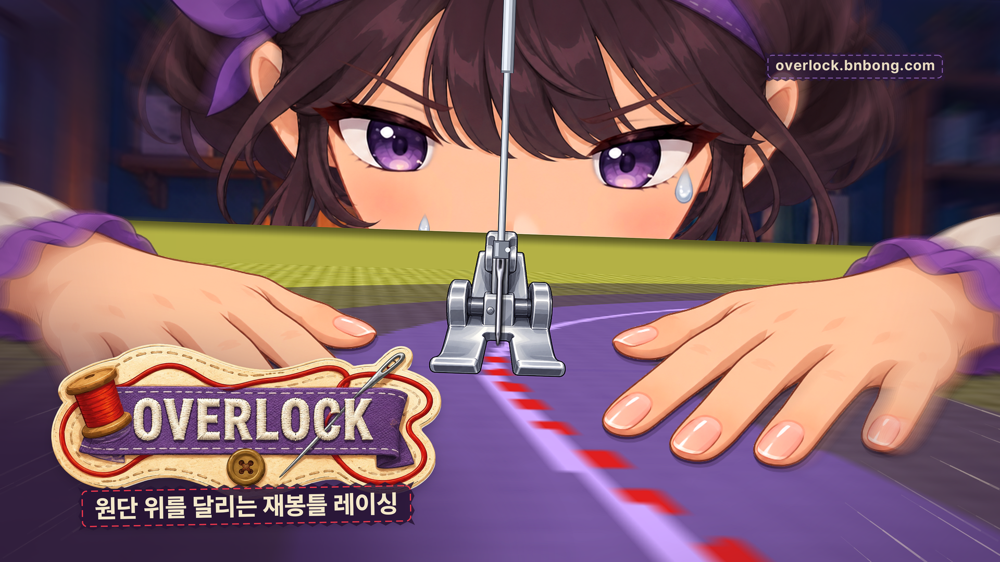

# Overlock 16:9 대표 홍보 이미지 (키 비주얼)



이 문서는 Overlock의 16:9 대표 홍보 이미지를 어떤 재료로 어떻게 만들었는지 설명합니다. 이미지는 새로 그린 그림이 아니며, 실제 게임 화면을 캡처한 스틸과 게임에 들어 있는 브랜드 에셋을 합성하고 보정한 뒤 글자를 얹어서 완성했습니다.

## 파일과 용도

| 파일 | 크기 | 형식 | 용도 |
| --- | --- | --- | --- |
| `overlock_key_visual_16x9_3840.png` | 3840×2160 | PNG, sRGB | 마스터 원본입니다. 인쇄물이나 큰 배너처럼 해상도가 필요한 곳에 씁니다. |
| `overlock_key_visual_16x9_1920.png` | 1920×1080 | PNG, sRGB | 스토어 대표 이미지, 웹 페이지 헤더, 발표 자료에 씁니다. |
| `overlock_key_visual_16x9_1280.jpg` | 1280×720 | JPEG 품질 90, sRGB | 영상 섬네일과 SNS 공유용입니다. 용량은 약 0.24MB입니다. |
| `overlock_key_visual_16x9_3840_clean.png` | 3840×2160 | PNG, sRGB | 로고와 문구를 모두 뺀 판입니다. 다른 언어로 문구를 새로 얹거나 다른 레이아웃에 배경으로 쓸 때 사용합니다. |
| `keyvisual_alternatives/overlock_key_visual_alt_B_1920.jpg` | 1920×1080 | JPEG | 탈락한 시안 B(좌측 타이포 패널과 우측 게임 화면의 분할 구도)입니다. |
| `keyvisual_alternatives/overlock_key_visual_alt_C_1920.jpg` | 1920×1080 | JPEG | 탈락한 시안 C(게임 화면 카드와 엄마 스티커, 골무를 곁들인 콜라주)입니다. |

축소본은 모두 마스터를 Lanczos 방식으로 리샘플해서 만들었습니다. 모든 파일에는 sRGB ICC 프로필이 들어 있습니다.

## 사용한 재료

### 게임 스틸

| 파일 | 사용한 곳 |
| --- | --- |
| `docs/promo/video/footage/stills/heart01_curve02_3840x2160_nohud.png` | 최종안의 주 이미지 |
| `docs/promo/video/footage/stills/star01_drift02_3840x2160_nohud.png` | 시안 B의 게임 화면 |
| `docs/promo/video/footage/stills/heart01_curve03_3840x2160_nohud.png` | 시안 C의 게임 카드 |

세 장 모두 4K 네이티브로 렌더한 HUD 없는 판입니다. 최종안은 `heart01_curve02`를 골랐습니다. 이 프레임에서는 노루발 바로 아래에서 시작한 빨간 스티치 재봉선이 화면 오른쪽 아래로 길게 휘어 나가기 때문에, 커브를 도는 레이싱 장면이 가장 분명하게 읽힙니다. 재봉선이 오른쪽으로 빠지므로 왼쪽 아래에 로고를 놓을 공간이 생긴다는 점도 선택한 이유입니다.

### 브랜드 에셋

| 파일 | 사용한 곳 |
| --- | --- |
| `game/assets/gfx/overlock_logo.png` | 모든 시안의 로고 |
| `game/assets/gfx/ui/mom_scolding.png` | 시안 C의 엄마 스티커 |
| `game/assets/gfx/item_thimble.png` | 시안 C의 골무 |

에셋 원본은 수정하지 않았고, 스크립트가 읽어서 메모리에서만 잘라 쓰고 크기를 줄였습니다. 로고는 원본(약 1700px 폭)보다 작은 1500px 폭으로 줄여서 배치했기 때문에 확대로 인한 흐림은 없습니다.

## 포인트 컬러

영상 작업과 같은 색 토큰을 사용했습니다.

| 이름 | 값 | 이 이미지에서 쓰인 곳 |
| --- | --- | --- |
| Thread Purple | `#8D62B9` | URL 표지의 바느질 점선, 시안 B와 C의 바느질 선 |
| Deep Plum | `#2A1838` | 부제 띠와 URL 표지의 바탕, 비네트와 왼쪽 아래 그라디언트, 암부의 미세한 색조 |
| Fabric Cream | `#F3E7C9` | 부제와 URL 글자, 원단 위 속도선 |
| Stitch Red | `#E5364B` | 부제 띠 테두리의 바느질 점선 |
| Star Yellow | `#FFD43B` | 이번 최종안에서는 사용하지 않았습니다. |
| Ink Brown | `#47342A` | 시안 C의 말풍선 글자 |

화면 대부분은 게임 원단의 보라색이 차지하므로 보라 계열로 자연스럽게 통일됩니다. 빨강은 게임 속 재봉 스티치와 로고의 실, 부제 띠 테두리에만 나타나도록 제한했습니다.

## 문구

- 로고: `OVERLOCK` (게임 로고 이미지를 그대로 사용했습니다.)
- 부제: `원단 위를 달리는 재봉틀 레이싱`
- 주소: `overlock.bnbong.com`

부제는 기존 홍보물에 쓰인 `~재봉틀 레이싱~`을 이어받으면서, 원단 위를 달린다는 게임의 핵심 행동을 한 줄로 설명하도록 다시 썼습니다. 주소는 오른쪽 위에 작게 넣었습니다. Overlock은 스토어 없이 웹에서 바로 실행하는 게임이므로, 이미지만 보고도 접속할 곳을 알 수 있어야 한다고 판단했습니다. 여러 플랫폼이 재생 시간 표시를 얹는 오른쪽 아래는 피했습니다. 주소가 필요 없는 용도라면 `_clean` 판에 원하는 문구만 얹어서 쓰면 됩니다.

확인되지 않은 수치, 출시일, 스토어 로고, "무료" 표기, 다른 작품이나 상표의 이름은 넣지 않았습니다.

## 글꼴과 라이선스

- 글꼴: Pretendard 1.3.9 (`ExtraBold`는 부제에, `Bold`는 주소에, `SemiBold`는 시안 B의 주소에 사용했습니다.)
- 위치: `tools/promo/fonts/`
- 라이선스: SIL Open Font License 1.1이며, 전문은 `tools/promo/fonts/LICENSE.txt`에 들어 있습니다. OFL은 글꼴로 만든 이미지를 상업적으로 배포하는 행위를 허용합니다.

로고 글자는 글꼴이 아니라 게임 로고 이미지에 포함된 자수 글자입니다.

## 구도

최종안은 게임 화면을 화면 전체에 까는 구도입니다.

1. 주 이미지를 시계 방향으로 2도 기울였습니다. 커브를 도는 순간에 몸이 한쪽으로 쏠리는 느낌을 주기 위해서입니다. 회전하면 모서리가 비기 때문에 약 6% 확대해서 화면을 채웠고, 확대와 회전으로 잃은 선명도를 약한 언샤프 마스크로 보정했습니다.
2. 노루발 근처를 중심으로 방사형 줌 블러를 걸었습니다. 중심에서 멀어질수록 강해지도록 설정했기 때문에 얼굴과 눈, 노루발, 양손은 선명하게 남고 화면 가장자리에만 속도감이 생깁니다.
3. 앞쪽 원단 위에 크림색 속도선을 옅게 그렸습니다. 속도선은 노루발 아래의 소실점에서 뻗어 나가며, 손과 얼굴에는 닿지 않도록 반경을 제한했습니다.
4. 대비와 채도를 각각 5~6%만 올렸고, 어두운 부분에 Deep Plum 색조를 6% 섞었으며, 가장자리에 Deep Plum 비네트를 걸었습니다. 게임 본연의 색은 거의 그대로 유지됩니다.
5. 왼쪽 아래에 Deep Plum 그라디언트를 깔고 그 위에 로고와 부제 띠를 놓았습니다. 로고는 수평으로 두었기 때문에, 시계 방향으로 기운 게임 화면과 대비되어 화면이 더 역동적으로 보입니다. 로고의 오른쪽 위 모서리가 노루발과 겹치지 않도록 위치를 잡았고, 부제 띠는 로고의 단추가 가려지지 않도록 단추 바로 아래에 두었습니다. 부제 띠는 핑킹 가위로 자른 원단처럼 지그재그 테두리를 두르고 안쪽에 빨간 홈질 점선을 넣었습니다.
6. 로고와 문구를 포함한 모든 요소는 가장자리에서 5% 안쪽(4K 기준으로 좌우 192px, 상하 108px)에 들어 있습니다. 글자 없는 판과 비교해서 측정한 결과, 로고와 부제 묶음은 x 197~1694, y 1320~2031 범위에 있고 주소 표지는 x 2939~3620, y 202~311 범위에 있습니다.

HUD는 모두 뺐습니다. 속도 게이지와 미니맵이 로고와 부딪히고, 섬네일 크기에서는 HUD 글자를 읽을 수 없어서 오히려 화면을 복잡하게 만들기 때문입니다.

### 탈락한 시안

- 시안 B(분할 구도)는 글자 영역이 넓고 깔끔하지만, 게임 화면이 오른쪽으로 밀리면서 왼손 대부분이 가려지고 화면이 정적으로 보였습니다. 로고도 최종안보다 작아서 섬네일 크기에서 덜 읽혔습니다.
- 시안 C(콜라주)는 엄마 스티커와 골무 덕분에 게임의 개성이 잘 드러나지만, 게임 화면이 카드 크기로 줄어들어 주인공 구도의 힘이 약해졌습니다. 요소가 많아서 섬네일 크기에서는 주제가 흐려졌습니다.

## 재현 방법

작업 트리 루트에서 다음 명령을 한 번 실행하면 이 문서에 나온 파일 여섯 개가 모두 다시 만들어집니다.

```bash
tools/promo/keyvisual/build.sh
```

처음 실행하면 `tools/promo/keyvisual/.venv`에 가상 환경을 만들고 `requirements.txt`에 고정된 Pillow와 numpy를 설치합니다. 이미 준비된 가상 환경이 있다면 그 경로를 첫 번째 인자로 넘길 수 있습니다. 좌표와 크기, 색, 회전 각도, 블러 강도는 모두 `tools/promo/keyvisual/make_keyvisual.py`에 명시되어 있고, 난수는 고정된 시드를 사용합니다. 같은 환경에서 두 번 연속 빌드했을 때 모든 출력 파일의 SHA-1 해시가 일치하는 것을 확인했습니다.

시안 하나만 원하는 크기로 렌더하려면 다음과 같이 실행합니다.

```bash
python make_keyvisual.py --variant B --size 1920 --out alt_b.png
python make_keyvisual.py --variant A --clean --out clean.png
```

## 검증 결과

- 픽셀 크기: 네 개의 최종 파일은 모두 정확히 16:9(3840×2160, 1920×1080, 1280×720)입니다.
- 색 모드: 모두 RGB이며 sRGB ICC 프로필이 들어 있습니다.
- 용량: 3840 PNG는 6.91MB, 1920 PNG는 2.09MB, 1280 JPEG는 0.24MB, 글자 없는 3840 PNG는 5.73MB입니다.
- 100% 확대 점검: 로고, 부제, 주소, 눈, 노루발, 네 모서리를 원본 크기로 잘라서 확인했습니다. 한글이 깨진 곳이나 오탈자, 글자 주변의 헤일로, 계단 현상은 보이지 않았습니다.
- 축소 점검: 320×180과 640×360 크기에서도 `OVERLOCK` 로고와 얼굴, 노루발, 빨간 재봉선을 알아볼 수 있습니다. 부제는 640×360에서는 읽히지만 320×180에서는 읽기 어렵습니다. 주소는 640×360에서 겨우 읽히는 정도입니다.
- 웹 페이지 모의 삽입: 거의 흰색(#F6F6F4)과 거의 검은색(#121216) 바탕 위에 올려서 확인했습니다. 두 경우 모두 이미지 가장자리가 어둡게 마감되어 경계가 또렷합니다.
- 명도 대비(WCAG 기준): 부제 글자와 부제 띠 바탕은 13.7:1, 주소 글자와 표지 바탕은 13.3:1, 로고 자수 글자와 보라색 리본은 8.6:1입니다. 세 값 모두 일반 텍스트 기준인 4.5:1을 넘습니다.
- 게임 데이터 폴더: 작업에 Godot를 사용하지 않았으며, `~/Library/Application Support/Godot/app_userdata/Overlock/`의 `records.json`, `settings.json`, `logs/`는 작업 전후의 크기와 수정 시각이 같습니다.
