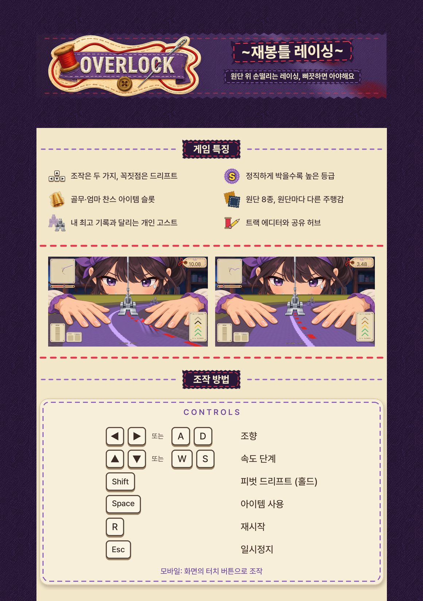

# itch.io 페이지 에셋



이 폴더에는 itch.io 게임 페이지를 꾸밀 때 테마 에디터와 본문 편집기에 올리는 이미지가 들어 있습니다. 모든 파일은 스크립트로 만들었으며, 키 비주얼과 같은 색 토큰과 Pretendard 글꼴, 게임에 들어 있는 에셋을 재료로 사용했습니다. 위 그림은 에셋을 실제 페이지처럼 배치했을 때의 분위기를 확인하려고 합성한 참고용 이미지이므로 itch.io에는 올리지 않습니다.

## 파일과 올리는 위치

| 파일 | 크기 | 용량 | 용도와 올리는 위치 |
| --- | --- | --- | --- |
| `banner_960x300.png` | 960×300 | 285KB | 투명 배경 배너입니다. 테마 에디터의 **Banner** 칸에 올립니다. |
| `banner_960x300_plum.png` | 960×300 | 218KB | Deep Plum 바탕을 채운 배너입니다. 투명 판의 가장자리가 페이지 배경과 어울리지 않을 때 **Banner** 칸에 대신 올립니다. |
| `banner_1920x600.png` | 1920×600 | 910KB | 투명 배너를 두 배 크기로 그린 마스터입니다. 다른 배너나 고해상도 용도에 씁니다. |
| `bg_tile_256.png` | 256×256 | 119KB | 데님 원단을 Deep Plum 톤으로 바꾼 무봉제 타일입니다. 테마 에디터의 **Background** 이미지로 올리고 반복(Tile)을 켭니다. |
| `bg_tile_stitch_256.png` | 256×256 | 120KB | 같은 타일 위에 빨간 홈질 점선을 흐리게 넣은 대안입니다. 사용 방법은 `bg_tile_256.png`와 같습니다. |
| `divider_960x12.png` | 960×12 | 1KB | 빨간 홈질 점선 구분선입니다. 본문 편집기에서 단락 사이에 이미지로 넣습니다. |
| `controls_960.png` | 960×530 | 89KB | 키캡으로 그린 조작법 블록입니다. 본문의 조작법 단락에 넣습니다. |
| `icon_controls.png` | 48×48 | 3KB | 특징 목록의 아이콘입니다(조작, 방향키 모양). |
| `icon_rank.png` | 48×48 | 5KB | 특징 목록의 아이콘입니다(등급, S 배지). |
| `icon_item.png` | 48×48 | 6KB | 특징 목록의 아이콘입니다(아이템 슬롯, 게임의 골무 아이콘). |
| `icon_fabric.png` | 48×48 | 6KB | 특징 목록의 아이콘입니다(원단, 펠트와 데님 견본 조각). |
| `icon_ghost.png` | 48×48 | 5KB | 특징 목록의 아이콘입니다(고스트, 반투명 노루발과 실제 노루발). |
| `icon_editor.png` | 48×48 | 3KB | 특징 목록의 아이콘입니다(에디터와 허브, 연필과 실패). |
| `heading_features_960x60.png` | 960×60 | 12KB | "게임 특징" 섹션 제목 띠입니다. 본문의 특징 목록 위에 넣습니다. |
| `heading_controls_960x60.png` | 960×60 | 13KB | "조작 방법" 섹션 제목 띠입니다. 본문의 조작법 블록 위에 넣습니다. |
| `gif_drift_fold.gif` | 640×360 | 2.66MB | 드리프트를 걸자 손끝 앞에서 원단이 접혀 올라오는 장면입니다. 46프레임, 12fps이며 반복 재생됩니다. 본문 또는 **Screenshots** 칸에 올립니다. |
| `gif_ghost_items.gif` | 640×360 | 2.67MB | 개인 고스트와 함께 달리는 장면에 이어 엄마 찬스 아이템을 쓰는 장면이 나옵니다. 52프레임, 12fps이며 반복 재생됩니다. 본문 또는 **Screenshots** 칸에 올립니다. |

PNG 파일에는 모두 sRGB ICC 프로필이 들어 있습니다. 배너(투명 판), 구분선, 조작법 블록, 아이콘, 제목 띠는 배경이 투명한 RGBA 이미지이고, Deep Plum 배너와 배경 타일은 불투명한 RGB 이미지입니다.

### 테마 설정값

테마 에디터에서 다음 값을 입력하면 에셋과 페이지의 색이 맞습니다. BG2를 크림색으로 두기 때문에, 본문에 들어가는 구분선과 조작법 블록, 아이콘은 크림 바탕에서도 읽히도록 만들었습니다.

| 항목 | 값 |
| --- | --- |
| Background | `#2A1838` (Deep Plum), 배경 이미지는 `bg_tile_256.png` |
| BG2 | `#F3E7C9` (Fabric Cream), 불투명도 100 |
| Text | `#3B2A2E` |
| Links | `#8D62B9` (Thread Purple) |
| Buttons | `#8D62B9` (Thread Purple) |
| Headers | `#2A1838` (Deep Plum) |
| Fonts | Noto Sans KR (제목과 본문 모두) |

Thread Purple 글자는 크림 바탕에서 명도 대비가 3.7:1이므로, 큰 글씨나 링크에는 충분하지만 긴 본문을 이 색으로 쓰는 것은 피하는 편이 좋습니다. 본문 글자색 `#3B2A2E`는 크림 바탕에서 11.0:1입니다.

## 사용한 재료

| 재료 | 사용한 곳 |
| --- | --- |
| `game/assets/gfx/overlock_logo.png` | 배너의 로고(1배 기준 폭 420px) |
| `docs/promo/overlock_key_visual_16x9_3840_clean.png` | 배너 뒤에 35% 불투명도로 깐 원단 띠(손가락이 나오지 않는 아래쪽 원단 부분을 가로로 잘랐습니다) |
| `game/assets/gfx/fabrics/fabric_denim.png` | 배경 타일, 원단 아이콘 |
| `game/assets/gfx/fabrics/fabric_felt.png` | 원단 아이콘의 뒤쪽 견본 |
| `game/assets/gfx/item_thimble.png` | 아이템 아이콘 |
| `game/assets/gfx/presser_foot.png` | 고스트 아이콘 |
| `docs/promo/video/overlock_promo_1080p60.mp4` | GIF 두 개 |
| `docs/promo/screenshots/gameplay_fold.png`, `gameplay_ghost.png` | 페이지 모의 합성(참고용)에만 사용했습니다. |
| `tools/promo/fonts/Pretendard-*.otf` | 모든 글자 |

부제 띠는 키 비주얼과 같은 함수(`tagline_plate`)로 그렸기 때문에 핑킹 가위로 자른 테두리와 빨간 홈질 점선이 키 비주얼과 같습니다. 조작법 블록의 키캡은 원페이퍼 포스터의 CONTROLS 카드와 같은 색과 모양을 960px 폭에 맞춰 다시 그렸습니다. 등급 아이콘과 방향키 아이콘, 연필과 실패 아이콘은 게임에 알맞은 에셋이 없어서 단순한 도형으로 새로 그렸습니다. 게임 에셋 원본은 수정하지 않았습니다.

## GIF 구간

| 파일 | 영상 구간 | 프레임 | 용량 |
| --- | --- | --- | --- |
| `gif_drift_fold.gif` | 18.00~21.80초 (3.8초) | 46 | 2,657,693바이트 |
| `gif_ghost_items.gif` | 15.30~17.45초와 21.85~24.00초를 이어 붙였습니다 (4.3초). | 52 | 2,665,232바이트 |

드리프트 GIF는 처음에 19.0~23.0초로 계획했지만, 영상은 21.82초에 엄마 찬스 장면으로 넘어갑니다. 그래서 구간을 앞으로 옮겨 DRIFT 표시와 Shift 키캡이 나오는 장면(18.0초)에서 시작하고, 원단 주름 장면이 끝나기 직전(21.8초)에 멈추도록 잘랐습니다. 고스트·아이템 GIF는 고스트 장면과 엄마 찬스 장면 사이에 드리프트 장면이 끼어 있으므로, 두 장면만 골라서 하나로 이었습니다.

두 GIF 모두 폭 640px, 12fps로 만들었고, 클립마다 팔레트를 따로 만들었습니다(`palettegen`과 `paletteuse`). 영상은 카메라가 움직이면서 질감이 있는 원단을 비추기 때문에 256색으로 그대로 변환하면 각각 약 5MB가 됩니다. 시간축 잡음 제거(`hqdn3d`)를 약하게 걸고, 팔레트를 96색으로 줄이고, 바이어 디더링을 거칠게 설정해서 두 파일 모두 3MB 아래로 맞췄습니다. `-ss`를 입력 옵션으로 두었기 때문에 ffmpeg가 시작 지점을 정확하게 찾아서 자릅니다.

## 미리보기

`preview/` 폴더에 있는 파일은 확인용이며 itch.io에 올리지 않습니다.

| 파일 | 내용 |
| --- | --- |
| `preview_banner_on_cream.png` | 투명 배너를 크림 바탕에 올린 모습입니다. |
| `preview_banner_on_plum.png` | 투명 배너(위)와 Deep Plum 배너(아래)를 Deep Plum 바탕에 올린 모습입니다. |
| `preview_bg_tile_256_3x3.png`, `preview_bg_tile_stitch_256_3x3.png` | 배경 타일을 3×3으로 반복한 모습입니다. 이음매가 보이지 않습니다. |
| `preview_divider_on_cream.png` | 구분선을 크림 바탕과 Deep Plum 바탕에 올린 모습입니다. |
| `preview_controls_on_cream.png` | 조작법 블록을 크림 바탕에 올린 모습입니다. |
| `preview_icons.png` | 아이콘 여섯 개를 실제 크기와 두 배 크기로 크림 바탕과 Deep Plum 바탕에 올린 모습입니다. |
| `preview_headings_on_cream.png` | 섹션 제목 띠 두 개를 크림 바탕에 올린 모습입니다. |
| `preview_page_mock.png` | 배경 타일, 크림 기둥(960px), 배너, 제목 띠, 아이콘, 구분선, 스크린샷 두 장, 조작법 블록을 한 페이지로 합성한 모습입니다. |

## 다시 만들기

작업 트리 루트에서 다음 명령을 실행하면 이 폴더의 파일이 모두 다시 만들어집니다.

```bash
tools/promo/itch/build.sh
```

처음 실행하면 `tools/promo/itch/.venv`에 가상 환경을 만들고 `tools/promo/keyvisual/requirements.txt`에 고정된 Pillow와 numpy를 설치합니다. 이미 준비된 가상 환경이 있다면 그 경로를 첫 번째 인자로 넘길 수 있습니다. GIF를 만드는 단계에는 ffmpeg가 필요하며, PATH에 없다면 `FFMPEG` 환경 변수로 경로를 지정합니다.

단계별로 따로 실행할 수도 있습니다.

```bash
python tools/promo/itch/make_itch_assets.py              # PNG 에셋과 미리보기
python tools/promo/itch/make_itch_assets.py --no-preview # PNG 에셋만
python tools/promo/itch/make_itch_assets.py --out <폴더>  # 다른 폴더에 출력
tools/promo/itch/make_gifs.sh [<폴더>]                    # GIF 두 개
```

스크립트에는 난수가 없고, 모든 요소를 두 배(아이콘은 네 배) 크기로 그린 뒤 Lanczos 방식으로 줄입니다. ICC 프로필의 생성 날짜는 키 비주얼 스크립트와 같은 방식으로 비워 두었습니다. 같은 환경에서 두 번 연속 빌드했을 때 PNG와 GIF를 포함한 모든 출력 파일의 SHA-1 해시가 일치하는 것을 확인했습니다.
