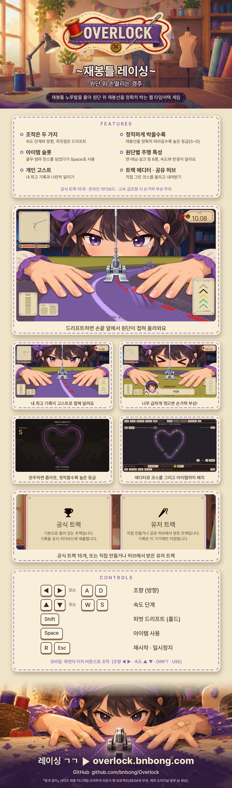
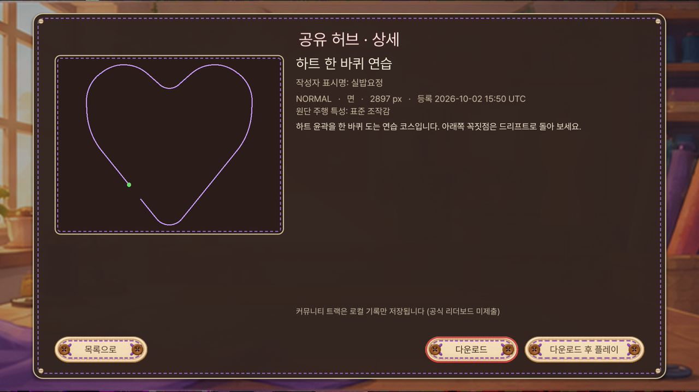
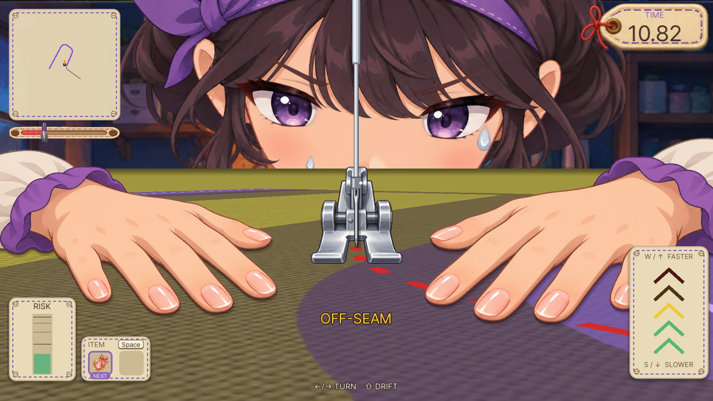
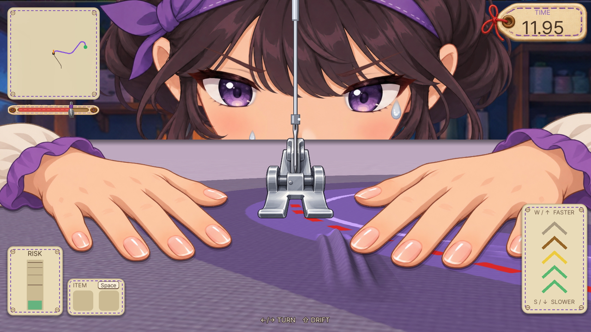
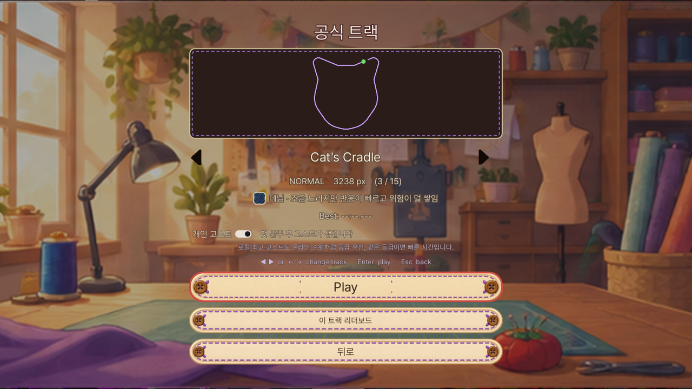
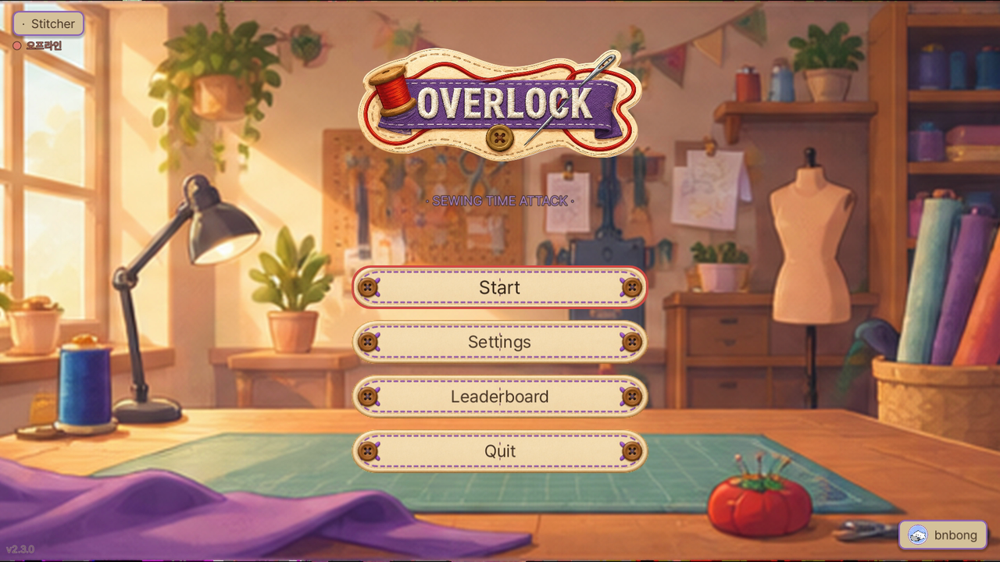

재봉틀 노루발을 레이싱 머신처럼 몰아 원단 위 재봉선을 정확히 박는 무료 웹 타임어택 게임.

- **플레이**: https://overlock.bnbong.com (데스크톱 브라우저 권장)
- **현재 버전**: v2.3.0

## 특징

- 조작 두 가지 - 속도 단계 & 방향, 꼭짓점은 드리프트
- 재봉선을 얼마나 정직하게 따라갔는지가 실력(S~D 등급)
- 아이템 슬롯 - 골무·엄마 찬스를 담았다가 Space로 사용
- 원단별 주행 특성 - 면·데님·실크 등 8종, 사실적인 원단 질감
- 드리프트하면 손끝 앞에서 원단이 주름으로 접혀 올라옴
- 개인 고스트 - 내 최고 기록과 나란히 달리기
- 고속 급조향 시 손가락 부상
- 공식 트랙 15 - 하트, 고양이, 별, F1 참고 서킷 등
- 트랙 에디터(아이템 배치·구간 지우기) · 공유 허브 · 온라인 리더보드

## 조작법

| 키 | 동작 |
| --- | --- |
| ←→ / A D | 조향 |
| ↑↓ / W S | 속도 |
| Shift (홀드) | 드리프트 |
| Space | 아이템 사용 |
| R | 재시작 |
| Esc | 일시정지 |

모바일에서는 화면의 터치 버튼(조향 ◀ ▶, 속도 ▲ ▼, DRIFT, USE)으로 조작합니다.

## 인게임 스크린샷

| | |
| --- | --- |
|  |  |
|  |  |
|  |  |
|  |  |
|  |  |
|  | |

스크린샷과 홍보 영상은 모두 v2.3.0 빌드를 macOS 데스크톱에서 촬영했습니다. 공유 허브 화면의 게시물은 촬영용 데모 데이터입니다.

---

『용과 같이』 시리즈 재봉 미니게임 오마주의 비공식 팬 프로젝트(SEGA와 무관, 에셋 오리지널·일부 AI 생성).
