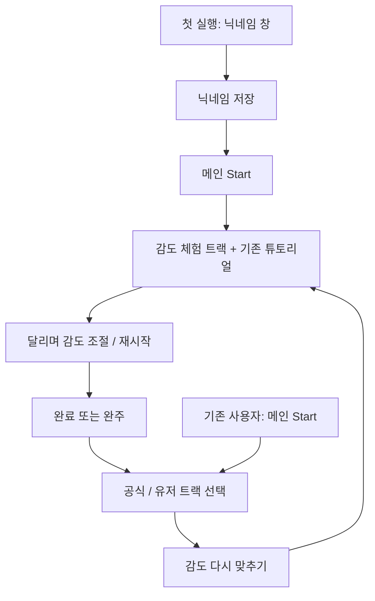

# 조향 감도 체험 트랙 작업 계획

## 목표와 범위

처음 실행해 닉네임 창을 거친 사용자는 메인 메뉴의 **Start**를 처음 누를 때 감도 체험 트랙으로 곧장 들어간다. 기존 사용자는 Start에서 기존처럼 공식/유저 트랙 선택 화면으로 이동한다. 이 선택 화면 아래에 **감도 다시 맞추기** 버튼을 두어 누구나 체험을 반복할 수 있게 한다.

체험 주행 중 조향 감도를 즉시 바꿔 같은 코너를 다시 달려 볼 수 있어야 한다. 기존 설정 화면의 감도 슬라이더와 저장 방식은 유지한다. 체험 트랙은 경쟁 콘텐츠가 아니므로 공식/유저 목록, 최고 기록, 고스트, 온라인 리더보드에 나타나거나 데이터를 남기지 않는다.

## 확인한 코드 경로

| 기능 | 현재 위치 | 구현 시 연결점 |
|---|---|---|
| 닉네임 모달과 Start | `game/scripts/ui/MainMenu.gd` | `_ready()`에서 닉네임 부재 확인, `_on_start_pressed()`에서 종류 선택으로 이동 |
| 종류 선택 화면 | `game/scripts/ui/TrackKindSelectScreen.gd` | 두 카드, 뒤로 버튼, 명시적 키보드 포커스 경로 |
| 감도 값과 영속성 | `game/scripts/ui/SettingsScreen.gd`, `game/scripts/autoload/LeaderboardClient.gd` | `Tuning.steer_expo`, 범위 0.25~0.65, `save_steer_expo()`와 `user://settings.json` |
| 감도 체감 | `game/scripts/player/PlayerController.gd` | `_expo()`가 중간 조향 출력에 적용됨. 값이 **작을수록 민감**, 클수록 부드러움. 풀조향 회전력은 동일 |
| 주행·튜토리얼 | `game/scripts/systems/RaceDirector.gd`, `game/scripts/ui/TutorialDialog.gd` | 현재 튜토리얼은 `tutorial_seen == false`인 최초 주행에만 표시 |
| 트랙 로딩·기록 | `game/scripts/autoload/TrackLoader.gd`, `game/scripts/autoload/GameState.gd`, `game/scripts/ui/ResultScreen.gd` | 공식 트랙은 manifest로 목록화, 완주 시 RaceDirector가 로컬 기록 저장 후 Result로 전환 |

## 사용자 흐름



1. **첫 실행의 정의:** 메인 메뉴가 최초 닉네임 모달을 띄우는 상태, 즉 저장된 유효 닉네임이 없을 때만 `calibration_intro_pending`을 준비한다. 닉네임 저장과 함께 이 상태를 `settings.json`에 남겨 앱을 재실행해도 첫 Start의 목적지가 유지되게 한다. 기존 설치에 이 키가 없고 닉네임이 이미 있으면 `false`로 읽는다. 닉네임만 바꾸거나 삭제/재설정한 기존 사용자에게 첫 실행을 다시 적용하지 않는다.
2. **첫 Start:** 준비 상태라면 데모에 바로 입장하고 상태를 소비한다. 저장 실패는 사용자에게 알리고 재시도할 수 있게 한다. 데모에서 나와도 자동 입장하지 않으며 선택 화면의 버튼으로 다시 들어갈 수 있다. 닉네임을 정하지 못한 동안은 현재 모달의 입력 흐름을 유지한다.
3. **데모의 튜토리얼:** 첫 입장에는 현재 `TutorialDialog`를 표시한다. 다시 맞추기 입장에서도 이 튜토리얼을 표시한다. 일반 첫 주행에서 이미 봤는지와 관계없이 데모에서는 매 입장 시 표시하며, 데모에서 본 경우 기존 `tutorial_seen`은 true로 저장한다. 튜토리얼이 닫히기 전에는 카운트다운과 주행이 시작되지 않는다. 기존 코치마크 내용은 유지하고 데모 전용 짧은 안내를 추가한다.
4. **데모 종료:** 사용자가 **맞추기 완료**를 누르거나 결승선을 통과하면 공식/유저 트랙 선택 화면으로 이동한다. 중도 종료(일시정지의 메뉴/M)도 같은 화면으로 간다. **다시 달리기**/R은 현재 감도 그대로 트랙 시작점으로 돌아간다. 선택 화면에 돌아왔을 때 기본 포커스는 공식 트랙 카드다.
5. **일반 주행:** 기존 Start, 트랙 선택, 에디터 테스트, 설정 화면, 공식 결과 화면의 흐름은 그대로다.

## 화면 구성

### 공식/유저 트랙 선택

기존 두 카드 아래에 폭 약 320px의 보조 버튼 **감도 다시 맞추기**와 짧은 설명 **"직접 달리며 조향 감도를 조절"**을 추가한다. 뒤로 버튼은 그 아래에 둔다. 새 버튼은 카드보다 시각적 우선순위를 낮추되, 포커스 테두리와 터치 높이는 기존 버튼 관례를 따른다. ↑↓ 이동은 `공식/유저 카드 → 감도 버튼 → 뒤로` 순서가 되게 한다. 1280×720과 844×390 모바일 가로 화면에서 카드·버튼·힌트가 잘리지 않게 카드 높이/세로 간격을 재배치한다.

```text
       어떤 트랙을 달릴까요?
   ┌────────────────┐  ┌────────────────┐
   │   공식 트랙    │  │    유저 트랙   │
   └────────────────┘  └────────────────┘
           [ 감도 다시 맞추기 ]
        직접 달리며 조향 감도를 조절
                 [ 뒤로 ]
```

### 데모 주행 HUD

기존 HUD와 튜토리얼을 재사용하고, 코스·바늘을 가리지 않는 상단 또는 좌측 여백에 작은 베이지 재봉 패치 스타일의 패널을 추가한다. 위치는 실제 HUD 및 모바일 터치 버튼과 겹치지 않도록 두 뷰포트에서 확인한다. 패널에는 다음을 담는다.

- 제목: **조향 감도 맞추기**
- 도움말: **"빠르게: 작은 조향에도 잘 꺾임 · 부드럽게: 천천히 꺾임"**. 현재 설정의 `부드러움 %`와 같은 방향으로 슬라이더를 둔다. 왼쪽이 반응 빠름(`steer_expo` 낮음), 오른쪽이 부드러움(`steer_expo` 높음)이다.
- `−`/`+` 버튼과 슬라이더, 현재 `부드러움 NN%` 표시. 기존 설정 화면의 0~100 ↔ 0.25~0.65 매핑 및 1% 단위를 그대로 쓴다. 마우스·터치로 슬라이더를 조작하고, 키보드 주행 중에는 조향키와 겹치지 않는 `[`/`]`로 값을 조절할 수 있게 한다. 키보드 포커스가 슬라이더에 있을 때 ←/→가 차량 조향에도 들어가지 않도록 입력을 정리한다.
- 안내: **"설정에서도 언제든 바꿀 수 있어요"**.
- **다시 달리기**, **맞추기 완료** 버튼. 재시작은 보존된 감도로 진행하고 완료는 선택 화면으로 복귀한다.

```text
┌─ 조향 감도 맞추기 ──────────────────────┐
│ 빠르게 ◀  [−] ━━━━━●━━━━ [+]  ▶ 부드럽게 │
│             부드러움 63%               │
│ 설정에서도 언제든 바꿀 수 있어요        │
│ [다시 달리기]      [맞추기 완료]        │
└───────────────────────────────────────┘
```

슬라이더 변경은 `Tuning.steer_expo`에 즉시 반영한다. 드래그 종료, 짧은 디바운스, 완료/재시작/종료 시 `LeaderboardClient.save_steer_expo()`로 저장한다. 저장 실패 시 조작값은 현 세션에 유지하고 패널에 실패 안내를 보인다. 입장 시에는 현재 저장값에서 시작한다. 별도의 감도 체계나 프리셋은 만들지 않는다.

튜토리얼에는 데모에서만 한 줄을 추가한다: **"이 코스에서 좌우 코너와 드리프트를 시험하며 감도를 맞춰 보세요. 설정에서도 언제든 변경할 수 있어요."** 기존 조작·HUD 코치마크를 그대로 보여 주고, 안내 문구가 모바일 가로 화면에서 겹치면 별도 데모 안내를 튜토리얼 닫힌 직후 패널에 배치한다.

## 데모 트랙 디자인

**형태:** 좌우 조향을 번갈아 시험하는 완만한 S구간 → 직선 가속 → 넓은 우회전 → 직선 → 좀 더 짧은 좌회전 → 결승. 오픈 코스이며 유턴과 교차가 없다. 부상 위험 없이 1~2단에서도 통과할 수 있고, 우회전은 3단 이상에서 드리프트를 시험할 여지를 둔다. 드리프트는 필수로 만들지 않는다.

```text
START ───────╮     ╭─────────────╮
             ╰─────╯             │  우회전/드리프트
                                 │
                FINISH ◀─────────╯
                     좌회전
```

- `res://tracks/demo/steer_calibration.json` 같은 별도 리소스로 둔다. `track_id = steer_calibration`, `fabric = cotton`, `difficulty = beginner`, `items = []`, `modifiers = []`. 원단 효과와 아이템을 빼 감도 차이만 체감하게 한다.
- 베지어 6~8구간, 권장 길이 약 2,500~3,200px. 출발 직선은 350~450px, S구간은 두 방향으로 각각 150~250px 편위, 코너 전후에는 300px 이상의 직선을 둔다. `perfect ≈ 22`, `safe ≈ 55`, `fail ≈ 110`으로 공식 입문 트랙보다 여유를 준다. 수치는 제작 출발점이며 베이크 후 실제 주행으로 조정한다.
- 모든 구간은 접선이 이어지게 만들고, 급격한 지그재그·자기근접은 피한다. `TrackValidator.validate()`로 최소 곡률 반경 28px, 하드 길이 1,500~8,000px, 자기근접을 확인한다. 초보자에게 무리 없는 코너인지 1~3단과 드리프트 양쪽으로 직접 주행 확인한다.
- 공식 `index.json`에 넣지 않는다. `TrackLoader`는 이 한 ID만 데모 경로로 로드할 수 있게 한다. 다른 공식 ID 로딩 규칙이나 커스텀 접두는 유지한다.

## 구현 순서와 주의점

1. `LeaderboardClient`의 기존 `settings.json` 로딩·직렬화에 첫 체험 대기 상태를 추가하고, **키 없는 기존 설치**의 기본값을 닉네임 유무로 안전하게 정한다. 메인 메뉴 닉네임 저장 경로와 첫 Start 분기를 연결한다.
2. `GameState`에 데모 주행 출처를 명시하고 진입·재시작·종료 시 출처가 새지 않게 한다. `TrackLoader`에 데모 ID의 단일 로딩 분기를 둔다. 데모 트랙 JSON을 작성한다.
3. `RaceDirector`가 데모 입장 시 튜토리얼을 매번 표시하고 감도 패널을 HUD에 얹는다. `tutorial_seen`은 기존 일반 주행 로직과 호환한다. 감도 패널은 기존 저장 API를 재사용한다.
4. 완주 시 데모는 `RecordStore.submit_run`, 고스트 저장/재생, `GameState.to_result`를 거치지 않고 종류 선택 화면으로 간다. 완주 줌아웃을 유지할 수 있으나 결과·등급·신기록 UI는 보이지 않는다. 중도 종료도 같은 경로다. 에디터 테스트 분기와 일반 결과 경로를 바꾸지 않는다.
5. 종류 선택 화면에 재진입 버튼을 추가하고 포커스 경로·터치 크기를 정리한다. README 조작법 또는 사용자 안내 문구가 필요하면 짧게 갱신한다.

## 완료 기준

- 새 설치에서 닉네임 창 → 저장 → 첫 Start → 데모 + 기존 튜토리얼 → 감도 조절 → 종류 선택이 이어진다. 닉네임 저장 후 재실행해도 첫 Start에서 데모로 간다.
- 기존 설정 파일에 닉네임은 있으나 새 키가 없으면 Start가 기존 종류 선택으로 간다. 데모 완료/중도 종료 후 다음 Start도 종류 선택으로 간다.
- 종류 선택의 버튼으로 데모에 반복 입장하고 매번 튜토리얼이 뜬다. 일반 첫 주행 튜토리얼은 데모를 보지 않은 사용자에게 계속 동작한다.
- 주행 중 감도값이 즉시 달라지고 설정 화면에서 같은 값이 보인다. 새로고침/재실행 후에도 유지되며 저장 실패를 알린다.
- 데모 주행이 공식/유저 목록, 마지막 선택 트랙, 기록·고스트 파일, 리더보드 제출, Result 화면에 흔적을 남기지 않는다.
- `tools/start_flow_regression`에 새 분기와 복귀 경로의 의미 있는 회귀 검사를 추가하고, 기존 `tools/menu_ux_regression`의 설정 감도 검사도 통과한다. 데스크톱과 844×390 모바일 가로 화면에서 패널 겹침 및 버튼 터치 가능성을 확인한다.
